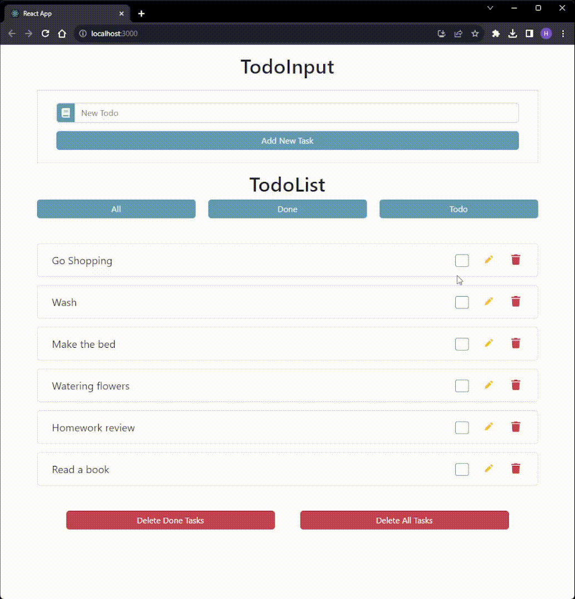

# Technology
- `Java Core`
- `Java SpringBoot`
- `React`
- `Bootstrap`

## Database
- H2 Database

## dependency
- Spring Web
- Spring Data JPA

# In App Images 

<h1>Add Task</h1>

<h1>Check Task</h1>

<h1>All, Done and Todo Buttons</h1>

<h1>Update Task</h1>

<h1>Delete Task</h1>

<h1>Delete Done and Delete All Button Task</h1>

